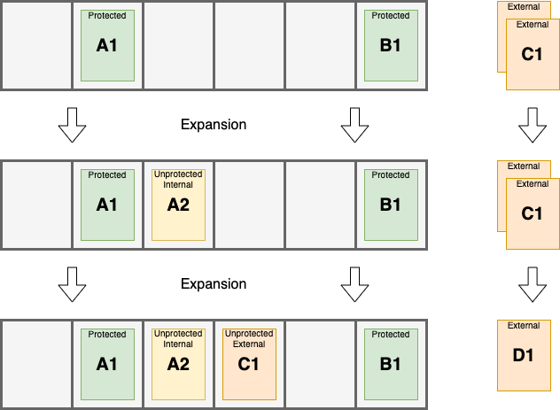

# Occamy

<em>
Servers that utilise spare resources for computational intense distributed tasks. 
</em>

Elastic horizontal scaling of services in cloud infrastructure is a convenient and effective way to provide the required resources for running a service with minimal wastage. For computational intense request which have irregular and unpredictable schedules resources often end up being overprovisioned/underutilised to ensure that requests can be handled promptly.

Occamy servers are designed to utilises spare provisioned resources. The server

1. ensures resources can promptly handle any incoming request, and
2. uses spare resources to assist in processing current requests.

The core idea is to have computational tasks which expand by creating assistant tasks to help the computation and can be stopped to provide resources for new incoming request with the server providing coordination.

<em>
Scaling of tasks within a service.
</em>

Elastic horizontal scaling is like a library that adds or removes bookcases depending on the number of books. In contrast, Occamy's scaling is like adding duplicate books if there is space and removing duplicate books if new books arrive. The name Occamy comes from the fictional creature which can shrink and grow to fit the empty space around it.

### The Original Use Case

The original use case provides a useful example in understanding the design of the Occamy server. The situation was as follows:

1. There was a distributed service (microservices) for handling optimisation requests in which all communication was asynchronous. The requests had to be handled promptly but had irregular and unpredictable schedules with frequent bursts.
2. Optimisations required between 4 & 12 CPUs for between one & ten minutes to provide results. Additional CPUs could be used in parallel to provide better or faster results. These optimisation were performed using a master and assistants approach where there was a minimum number of assistants considered necessary.
3. There was balancing between providing enough resources so that requests could be handled promptly and minimising wastage. 

Ultimately, the requirement to handle requests promptly was a considered a requirement which meant there was a minimum amount of resources provisioned. The aim became to use the spare resources while not blocking or delaying incoming requests. There are two simple scenarios demonstrate the basic requirements.

**Scenario A:** A request comes in while there are no requests currently being handled and no other requests come in while this request is being handled. In this scenario every instance of the microservices should be fully dedicated to handling the request.

**Scenario B:** A request comes in while there are requests being handled which are using more resources than is considered necessary for their respective optimisations. In this case enough of those unnecessary resources used should be freed to ensure the new request has its minimum amount of resources.

### The Distributed Systems View

An Occamy server is designed for distributed systems. The key points when regarding the whole system are:

- The servers are independent and have no knowledge of the servers.

- Communication to the servers is to be done using some messaging protocol. Messages will contain data along with ability to:
	- Acknowledge the message as succesfully handled and remove it from the queue.
	- Reject the message as impossible to handle and remove it from the queue.
	- Requeue the message if the server can not currently handle it e.g. it is shutting down. 

- The servers accept two kinds of messages:
  - *Request messages* are messages that represent a request for computation. Requests messages must be only sent to one server.
  - *Control messages* are messages that provide information to running tasks or to the Occamy server itself. Control messages must be passed to all servers.

### The Server View

Each server is intended to work independently. The key points when considering the individual servers are:

- The server must contain a limited of *slots* which can hold at most one task. A task represents a computation that to be done that also has the ability to handle data of message and the optional ability to create additional tasks. 

- The server has two two methods handling the two kinds of messages: 
	  - *Request messages* are converted into tasks. These task are assigned to an available slot. If there is no available slot or a task is interrupted before completion the corresponding message is requeued.
	  - *Control messages* will be passed on to all relevant tasks running or converted into task and set aside to be used in the expansion process (see below). This is based on the data contained in the message.

- The slots will have a status depending on the task.
  - *Empty* slots contain no task and can have a task added at any time.
  - Slots with status *protected* are running task which have been created due to an incoming request i.e. via the request handler. These tasks are never interrupted except when shutting the server down, in which the original message will be rejected and requeued.
  - Slots with status *unprotected* are running tasks which have been generated to utilise spare resources and created in the expansion process (see below). 
    These can be interrupted at any time. Tasks must be implemented to accept being killed quickly and without consequence.

    

- At regular intervals the server will run an *expansion* process. 
  During this process the server will check if there is empty slots and attempt to create and add new tasks in the following ways:
  1. The protected tasks will be checked to see if they can create additional tasks - an optional functionality. These tasks are assigned to slots and marked as *unprotected*.
  2. This is repeated for tasks in slots as marked *unprotected*.
  3. The server will use any task that was create from a request that came in as a control message. These task will be assigned slots and marked as *unprotected*

	Tasks are referred to as *internal* if they are created by *protected* or *internal* tasks. Tasks are referred to as *external* if they converted from a control message or are created by a *external* task.

 

### Comments

- It is recommended that implementations of the server is independent of all logic regarding the actual handling of requests. The functionality of converting messages to tasks should be setable in the initialisation of the server. This is to separate the concerns of managing the resource allotment for requests and handling of the requests.

- In the expansion process the order that *unprotected* tasks are created and add is not prescribed. It may be useful to include some notion of priority.

- All requests for computation should occur through the Occamy server. Tasks that require additional resources should send additional request messages for helper tasks and send a single request for a helper task as a control message.

- Scaling for distributed systems using Occamy servers should not be based on CPU as servers attempt to maximum CPU load. Instead services should be scaled based on the number of protected tasks relative to the maximum allowed tasks.

### Author

- [Peter E. Finch](github.com/PeterEFinch)

 